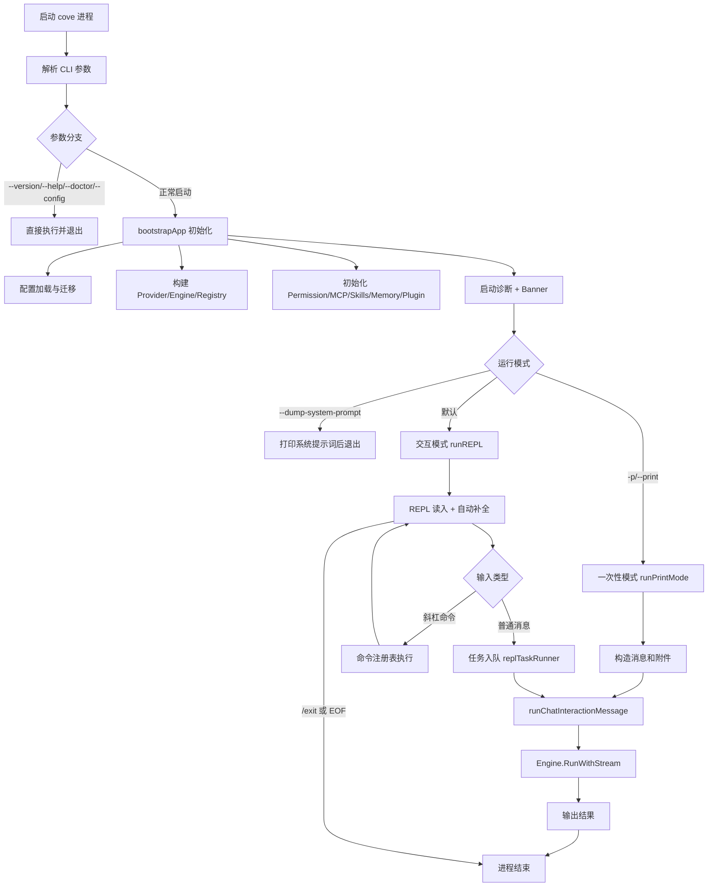
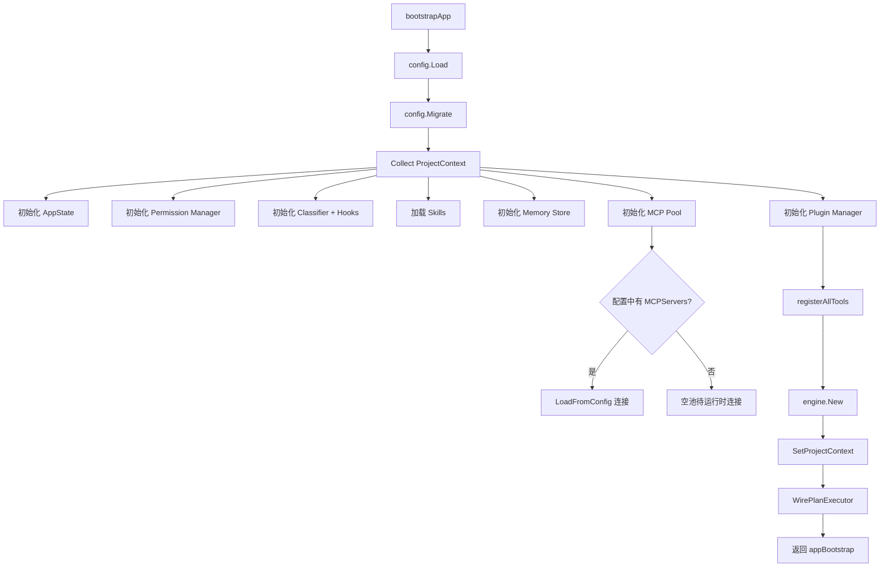
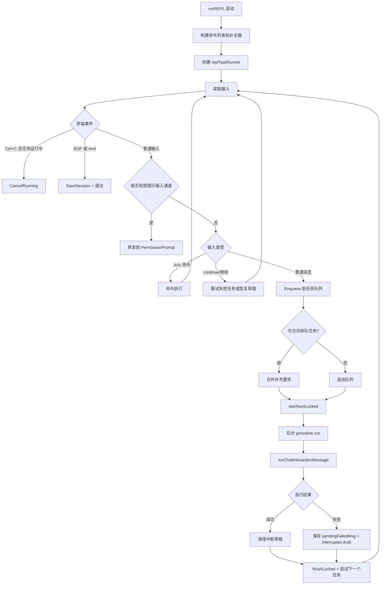
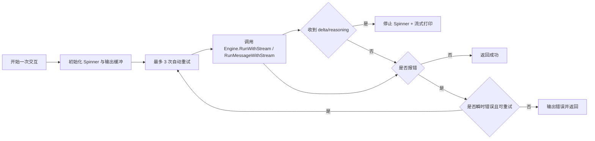
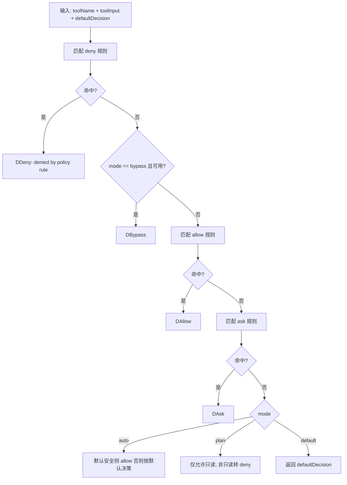
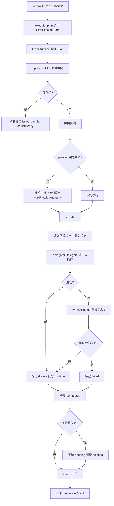
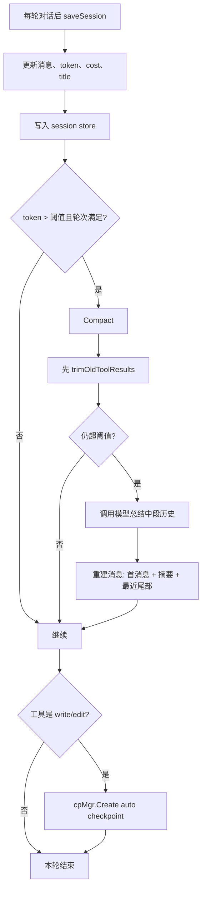
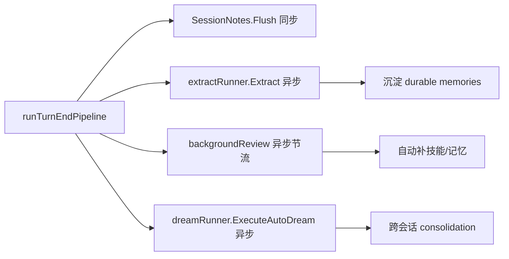

# Cove 全流程图（总览 + 模块内细化）

说明：本文件在端到端总流程基础上，补充各大模块内部运作流程，便于做技术展示与系统讲解。

## 1) 端到端总流程（保留总览）



## 2) 启动与初始化流程（bootstrapApp）



## 3) REPL 主循环与异步任务队列



## 4) 交互层流程（runChatInteractionMessage）



## 5) 引擎回合主流程（Engine.RunWithStream）

```mermaid
flowchart TD
    A[接收用户消息] --> B[写入 messages]
    B --> C[构建 SystemPrompt: tools/skills/memory/context]
    C --> D[for iter < MaxIterations]

    D --> E[Provider.Chat]
    E --> F{响应类型}
    F -->|纯文本| G[onDelta 流式输出]
    F -->|带 tool calls| H[解析工具调用]

    H --> I[并发安全工具并行(上限8) + 非并发工具串行]
    I --> J[executeTool]
    J --> K[将结果回灌为 tool message]
    K --> D

    G --> L[saveSession + cost/ratelimit 更新]
    L --> M[runTurnEndPipeline]
    M --> N[返回最终文本]

    D --> O{token 超阈值且可压缩?}
    O -->|是| O1[Compact 历史]
    O -->|否| E
    O1 --> E
```

## 6) 单次工具执行内部流程（executeTool）

```mermaid
flowchart TD
    A[按名称查找 Tool] --> B{存在?}
    B -->|否| B1[返回 unknown tool]
    B -->|是| C[Guardrail.BeforeCall]

    C --> D{Guardrail 决策}
    D -->|Block| D1[返回阻断错误]
    D -->|Warn/Allow| E[构造 tool.Context]

    E --> F{bash 分类器检查}
    F -->|危险命令| F1[直接拒绝]
    F -->|通过| G[Validate 输入]

    G --> H[Tool.CheckPermissions]
    H --> I[PermissionManager.Check]
    I --> J{allow/ask/deny/bypass}

    J -->|deny| J1[返回拒绝]
    J -->|ask| J2[触发 PermissionPrompt y/n/a]
    J2 -->|拒绝| J3[返回拒绝]
    J2 -->|允许| K[继续执行]
    J -->|allow/bypass| K

    K --> L{write/edit?}
    L -->|是| L1[异步自动 checkpoint]
    L -->|否| M
    L1 --> M[调用 t.Call]

    M --> N{执行错误?}
    N -->|是且瞬时错误| N1[重试一次]
    N -->|是且仍失败| N2[Guardrail.AfterCall(error) + 返回错误]
    N -->|否| O[Guardrail.AfterCall(success)]

    N1 --> O
    O --> P[trackFileChanges + 输出裁剪 + 条件技能注入 + 子目录提示]
    P --> Q[返回结果给模型]
```

## 7) 权限系统内部决策流程（permission.Manager.Check）



## 8) 计划执行器内部流程（execute_plan / plan executor）



## 9) MCP 与插件模块流程

### 9.1 MCP 命令侧流程（/mcp）

```mermaid
flowchart LR
    A[/mcp action] --> B{action}
    B -->|list| C[列 AllServers]
    B -->|connect| D[从配置取 server 并 Connect]
    B -->|disconnect| E[Disconnect 或 DisconnectAll]
    B -->|read| F[ReadResource 输出内容块]
```

### 9.2 MCP 工具侧流程（tool: mcp / mcp_resources / mcp_read_resource）

```mermaid
flowchart TD
    A[模型发起 mcp 工具调用] --> B[Permission: Asked]
    B --> C{批准?}
    C -->|否| C1[返回权限拒绝]
    C -->|是| D[pool.CallTool(server, tool, args)]
    D --> E[拼接 content/text]
    E --> F[返回模型]
```

### 9.3 插件管理流程（/plugin）

```mermaid
flowchart TD
    A[/plugin action] --> B{action}
    B -->|list| C[Refresh + AllPlugins]
    B -->|install| D[MarketplaceInstall 或 Install(name,url)]
    B -->|enable/disable| E[切换状态]
    B -->|uninstall| F[卸载]
    B -->|search/refresh/update| G[市场索引与更新]
```

## 10) 会话、压缩、检查点流程



## 11) 回合后自学习流水线（runTurnEndPipeline）



## 12) 代码锚点（定位）

- 启动入口：cli/cove/main.go
- 应用初始化：cli/cove/app_bootstrap.go
- REPL 主循环：cli/cove/repl_loop.go
- REPL 任务执行器：cli/cove/repl_tasks.go
- 交互与重试：cli/cove/chat_interaction.go
- 引擎主循环与工具执行：internal/engine/engine.go
- 权限系统：internal/permission/permission.go
- 计划执行器：internal/plan/executor.go
- MCP 工具桥接：internal/tool/mcp_tool.go
- 插件与 MCP 命令：internal/command/commands_integrations.go
